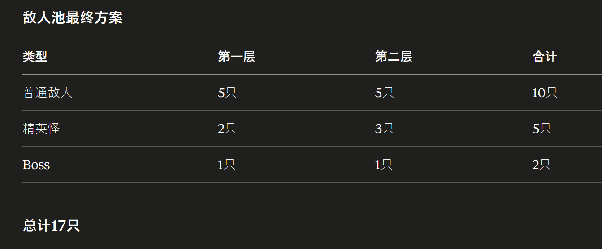

# 📑 《摸鱼牌侠》核心设计开发母本 (Master GDD)

## 0. 核心定位
*   **一句话简介**：第一人称沉浸式“职场生存”Roguelike，用 Emoji 连招喷飞老板。
*   **核心卖点**：Emoji 序列连击、职场梗共鸣、短平快爽感、核心卡双重进化分支。
*   **视觉风格**：奶油色 Lofi 滤镜，圆润的 UI，慵懒的背景音乐，带物理碰撞感的 Emoji 卡片。

---

## 1. 视觉与交互 (Visual & UI)
*   **视角**：**第一人称沉浸式**。屏幕上部 60% 为 BOSS（老板/怪物）；下部 40% 为弧形手牌与交互区。
*   **美学**：**Lofi 奶油色调**。柔和圆角 UI，背景有动态漂浮物（咖啡、咸鱼、纸飞机），伴随机械键盘音效。
*   **进度展示**：顶部 **“离职进度条”**，通过 10 个关卡节点即可达成结局。

---

## 2. 战斗系统：Emoji 序列连击 (The Sequence System)

### 2.1 基础数值
*   **压力值 (Stress/HP)**：玩家生命。随加班/受击增长，满值则“过劳”，游戏结束。
*   **摸鱼力 (Action Points)**：每回合回复 3-5 点，用于打出 Emoji。
*   **耐性值 (Boss HP)**：敌人的生命。归零则代表老板放弃挣扎，战斗胜利。

### 2.2 序列槽 (Slack-Chat Bar)
*   打出的 Emoji 依次进入中心**“聊天框”**（通常为 3 个槽位）。
*   **连招触发 (Combo)**：当符号组合符合配方（如 `💩` + `☕`），自动消耗序列并触发强力效果。

### 2.3 连招配方表 (Combo Recipes)

#### 通用连招 (Universal)
*   **【小丑竟是我自己】** (`🤡` + `🤡`)：伤害等同于已损失压力的 50%。
*   **【终极摸鱼】** (`💩` + `☕` + `💤`)：恢复满 HP 且跳过老板回合。
*   **【摸鱼三件套】** (`☕` + `💩` + `💧`)：抽 3 张牌，摸鱼力 +1。
*   **【职场老油条】** (`🤡` + `💤` + `🤡`)：获得 2 回合减损闪避。
*   **【带薪健身】** (`🏃` + `💧` + `💩`)：回复 10 HP，本场战斗 HP 上限 +5。

#### 角色专属连招 (Character Specific)
*   **博姆 (Boomtail)**:
    *   **【愤怒的键盘侠】** (`🔥` + `⌨️`)：本回合所有键盘伤害变为 3 倍。
    *   **【核能爆破】** (`🔥` + `💣` + `🧨`)：造成 30 点伤害，火大层数翻三倍。
    *   **【加班狂魔】** (`⌨️` + `⌨️` + `🔥`)：造成 25 点无视防御伤害。
*   **墨里 (Inkwell)**:
    *   **【浑水摸鱼】** (`💩` + `🌊`)：获得 15 点防御，且下回合多抽 2 张牌。
    *   **【墨雾逃生】** (`🐙` + `💨`)：本回合无敌，且移除所有垃圾卡。
*   **莱奥 (Leo)**:
    *   **【画大饼】** (`📊` + `📈` + `🍞`)：获得 3 层虚假希望（抵消致死伤害）。
    *   **【循环报表】** (`📊` + `📈` + `📊`)：重复释放本回合打出的所有数据卡效果。
*   **苏珊 (Susan)**:
    *   **【流程繁琐】** (`❌` + `📋`)：老板下 2 回合无法行动。
    *   **【带薪休假】** (`⏳` + `📋`)：回复 20 HP，且下回合 AP +2。

---

## 3. 角色设定与双重进化 (Heroes & Evolution)
每个角色拥有一个**不可删除的核心 Emoji**，在第 4 关和第 8 关可进行进化。

| 角色名称 | 职位 | 核心 Emoji | 第一次进化 (第4关) | 第二次终极进化 (第8关) | 玩法流派 |
| :--- | :--- | :--- | :--- | :--- | :--- |
| **博姆 (Boomtail)** | 爆破组初级工 | `🌰 (松果)` | **【焦土流】** `🔥🔥` | **【红莲地狱】** `☀️` | **持续叠火/爆发** |
| **墨里 (Inkwell)** | 饮水机之主 | `🐙 (触手)` | **【恐惧流】** `🦑` | **【深海意志】** `🌀` | **削减上限/反击** |
| **莱奥 (Leo)** | 项目经理 | `📊 (图表)` | **【PPT流】** `🎇` | **【全宇宙愿景】** `🪐` | **数据爆发/无限资源** |
| **苏珊 (Susan)** | HR 审判官 | `📋 (简历)` | **【禁令流】** `❌` | **【行业黑名单】** `🚫` | **强制停顿/规则裁决** |

### 3.1 终极进化设计 (Ultimate Skills)
*   **博姆 - 【红莲地狱】**：获得卡牌“大过滤器”。效果：消灭所有非火系手牌，每消灭一张，本回合火系伤害翻倍。
*   **墨里 - 【深海意志】**：获得卡牌“归于虚无”。效果：将老板耐性上限直接削减当前耐性值的 20%，并吸吸取同等数值的压力值（回复）。
*   **莱奥 - 【全宇宙愿景】**：获得卡牌“降维打击”。效果：将本场战斗所有记录过的数值相加并爆发，且本回合所有卡牌消耗变为 0。
*   **苏珊 - 【行业黑名单】**：获得卡牌“终极裁决”。效果：永久封印老板当前的所有意图，且老板每回合受到等同于其攻击力 2 倍的“违约金”伤害。

---

---

## 5. “离职之路” 10 关流程 (Road to Resignation)
# 📔《摸鱼牌侠》10关敌人全图鉴（正式版）

### 第一阶段：职场萌新（1-3关）—— 熟悉基础 Emoji 连击

#### 第 1 关：【传声鹦鹉】(Gossip Parrot)
*   **职场身份**：办公室秘书 / 薪资保密员
*   **设计逻辑**：鹦鹉模仿人类，对应“复读”与“八卦”。
*   **阴间机制：[复读干扰]** 🦜
    *   它会锁定玩家序列槽的**第 1 格**。
    *   该位置会自动填入玩家上一回合打出的**最后一个 Emoji**。
*   **教学意义**：教玩家规划“收尾”，为下一回合做伏笔。

#### 第 2 关：【闹钟刺猬】(Deadline Hedgehog)
*   **职场身份**：考勤打卡专员 / 居家办公监控员
*   **设计逻辑**：刺猬身上的刺是闹钟指针，象征“死线”的紧迫感。
*   **阴间机制：[节奏压迫]** ⏰
    *   Boss 身上有一个 3 回合倒计时。
    *   如果倒计时结束时，玩家没有打出包含 `⌨️(键盘)` 的 Combo，刺猬会全身缩成球，发动一次无视防御的高额伤害。
*   **教学意义**：强制玩家练习“快节奏 Combo 输出”。

#### 第 3 关：【薪水小偷】浣熊 (Salary-Thief Raccoon)

*   **职场身份：资深后勤 / 总是混迹在茶水间的神秘同事。

    外观特征：穿着一件松松垮垮的白衬衫，打着歪掉的领带。手里端着一个印有“Best Staff”的咖啡杯（里面其实装的是零食），口袋里塞满了偷来的订书钉和便签纸。

    设计逻辑：浣熊喜欢“洗东西”，在职场里就是**“洗掉你的劳动成果”**。

    阴间机制：[摸鱼洗牌] 🦝

        技能：他会盯着你的序列槽。每当你打出 2 个 Emoji 后，他有概率发动“顺手牵羊”，随机偷走你序列槽里的一个符号。

        影响：这会打断你的 3 连 Combo 配方，逼迫你本回合只能打出短连招，或者利用多出的 AP 重新补位。

    设计目的：考验玩家的**“应变能力”**。你不能死记硬背配方，必须在被偷走一个符号后，迅速思考怎么利用剩下的符号补救。
**
---
**[ 关卡间事件：茶水间 ]** —— 补给、删牌、调整心态。
---

### 第二阶段：职场深水区（4-6关）—— 干扰序列与精准操作

#### 第 4 关：【监控猿】(Surveillance Ape) —— **小 BOSS (第一次进化)**
*   **职场身份**：挂满摄像头的技术组长
*   **设计逻辑**：巨大的长臂猿，手臂上全是摄像头，眼睛是广角镜头。
*   **阴间机制：[重点监控]** 🔒
    *   每回合随机锁定一个序列槽（比如第 2 格）。
    *   玩家在该格**必须**填入它指定的 Emoji 类型（如必须填“火系”），否则全回合 Combo 失效。
    *   **提示方式**：战斗 UI 会显示“第 N 格 = 指定 Emoji 类型”，并在对应槽位高亮标注。
*   **进化点**：击败它后，玩家选择本命核心卡的第一个进化分支。

#### 第 5 关：【会议树懒】(Meeting Sloth)
*   **职场身份**：低效会议组织者 / 资深流程专家
*   **设计逻辑**：挂在时钟指针上的树懒，动作极慢，文件极多。
*   **阴间机制：[文档塞入]** 📄
    *   每回合往玩家手牌里塞 2 张 `📄(无意义文档)`。
    *   这些卡无法打出，但每张会降低玩家 5% 的攻击力。
    *   **解法**：玩家必须通过 Combo 触发“回收”效果来清理手牌。

第 6 关：【审计】猎犬 (The Audit Bloodhound) —— 合规部/资深审计

    职场身份：那个拿着放大镜看你每一张报销单、每一个字体的“合规判官”。

    外观特征：一只神情严肃、戴着单片眼镜的血提（或者拉布拉多），穿着笔挺的三件套西装。它的一只前爪按在厚厚的“员工守则”上，另一只爪子拿着一支钢笔。背景可以是由于审计而堆满的蓝色文件夹。

    设计逻辑：猎犬的鼻子很灵，它能闻出你牌组里的“水分”。

    阴间机制：[合规检测] 🔍

        技能：它每回合会发布一个“合规标准”（例如：本回合使用的 AP 总数必须是偶数，或者打出的 Emoji 颜色不能超过 2 种）。

        影响：如果你违反了合规标准，不再触发“伤害转回血”；改为在老板回合承受一次**额外追责伤害**（可预期、可承受）。

    设计目的：这关是策略转折点。它不要求你打出大数字，而是要求你有克制地出牌。这能让玩家在第 7 关“团建事件”前，深刻体会到“规则”的束缚。
---

### 第三阶段：职场天花板（7-9关）—— 机制大考与数值崩坏

#### 第 7 关：【PUA 毒蛇】(Gaslighting Viper)
*   **职场身份**：擅长精神控制的 HRBP / 恶毒导师
*   **设计逻辑**：身形阴冷，吐着的信子是红色的 KPI 走势线。
*   **阴间机制：[认知反转]** 🐍
    *   它施加一个场域，使玩家所有的“回血/减压”Emoji（如 `☕`, `💧`）全部失效。
    *   改为：回血数值会变成对玩家自己的伤害。
*   **教学意义**：强制玩家进入“不成功便成仁”的全输出流派。

#### 第 8 关：【画饼蜘蛛】(Dream-Weaver Spider) —— **精英 BOSS (第二次进化)**
*   **职场身份**：合伙人 / 擅长股权许诺的创始人
*   **设计逻辑**：金色的蜘蛛，网是由“假股票代码”织成的。
*   **阴间机制：[序列重组]** 🕸️
    *   当你输入完 Emoji 准备结算时，它有 50% 概率瞬间**打乱你槽位里的顺序**。
    *   **解法**：玩家需要利用“二次进化”后的核心卡，强制锁定序列或产生溢出伤害。
*   **进化点**：击败它后，玩家核心卡达成终极形态。

#### 第 9 关：【KPI 九头蛇】(The KPI Hydra)
*   **职场身份**：背负无数指标的部门大总监
*   **设计逻辑**：九个头分别写着：日活、转化、留存、ROI... 打掉一个长出两个。
*   **阴间机制：[指标增生]** 📈
    *   它是多血条机制。你必须在同一回合内，利用大范围 Combo（如【红莲地狱】）同时击破 3 个指标，否则它会不断回满血。
*   **教学意义**：测试玩家最终流派的爆发上限。

---
**[ 关卡间事件：整理工位 ]** —— 终局前状态全满。
---

然后在两个战斗关卡之间会随机出现以下20 个随机事件池

    茶水间八卦：[听听看] 揭示下关敌人意图，但下场初始 AP -1 / [走开] 回复 10 压力。

    同事求助：[帮改PPT] 删掉 1 张强力卡，获得被动：每回合首张牌 0 费 / [拒绝] 压力 +5。

    群聊手滑：[发表情包] 随机得 1 张高级卡，但本场 Boss 伤害 +2 / [及时撤回] 无事。

    饮水机遇老板：[大声问好] 下场初始 AP +1 / [低头快走] 压力 +15。

    打印机卡纸：[踢一脚] 下场首回合全体爆炸伤害，但随机丢 1 张手牌 / [清理] 升级 1 张基础卡。

    中央空调故障：[忍受] 每回合压力 +2 / [蹭空调] 获得 1 张闪避卡。

    神秘快递：[拆开] 50% 免控耳机，50% 塞 2 张垃圾卡 / [退回] 压力 -5。

    电梯偶遇：[挤进去] 压力 +10 / [等下一趟] 获得 1 张 ⏳ 连招卡。

    停电通知：[直接下班] 立即胜利，但无新卡奖励 / [开备用电源] 压力 +20，下场伤害翻倍。

    蓝屏瞬间：[心态崩了] 压力 +30，获 1 张 0 费神卡 / [重启] 删 1 张牌。

    旧工位笔记：[学习] 获 1 个随机 Combo 配方 / [丢弃] 压力上限 +5。

    体检报告：[不看] 压力 -10 / [看细节] 压力 +20，本局回血翻倍。

    带薪如厕：[刷视频] 压力回复 50 / [抽烟] 攻击 +5，但每回合扣 1 AP。

    摸鱼被抓包：[推卸给AI] 随机 2 张卡变随机 Emoji / [老实认错] 移除 1 张强力卡。

    私活邀请：[接单] 下 2 场战斗无卡牌奖励，但压力上限 +20 / [拒绝] 升级 2 张卡。

    深夜垃圾桶：[翻找] 获得 📊 数据卡 / [不看] 无事。

    全员核酸（梗）：[排队] 获得 1 回合无敌卡 / [插队] 压力 +20。

    办公椅坏了：[站着办公] 攻击 +3 / [修椅子] 压力 +10。

    朋友圈点赞：[互赞] 随机 1 张卡伤害 +5 / [忽略] 无事。

    老板的画饼：[吃饼] 获得 20 护盾卡，但牌组塞 1 张垃圾卡 / [不吃] 压力 +5。

### 终章：离职决战（第 10 关）

#### 第 10 关：【CEO 三头狮】(Chimera CEO) —— **最终大 BOSS**
*   **职场身份**：公司最高权力者
*   **设计逻辑**：狮头（威严）、羊头（虚伪）、蛇尾（暗算）。
*   **阴间机制：[职场终结者]** 👑
    *   **狮态**：只能打出攻击 Emoji，否则直接扣 10% 玩家血量。
    *   **羊态**：本回合所有单次伤害不能超过 10，强制你打出超长的小额连招。
    *   **蛇态**：封印你的摸鱼力（AP），你只能使用本回合产生的 0 费卡。
*   **登场对白**：“博姆/墨里/莱奥/苏珊……你是我见过最有‘潜力’的员工，真的不打算再考虑一下这份股权协议吗？”
*   **通关目标**：将 CEO 的“耐性值”彻底磨平，达成**离职结局**。

---

## 7. 剧情文本与关键对话 (Narrative & Dialogue)

### 7.1 关卡 8 精英战：画饼蜘蛛
*   **战前对白**：
    *   **蜘蛛**：“看看这些金色的线条，它们不是网，而是公司未来的 K 线图！只要你在这里待够五年，这些都是你的……”
    *   **玩家**：“五年太久，我只想现在打卡走人。”
*   **战后（终极进化触发）**：
    *   **系统提示**：你撕碎了虚假的股权协议。内心的摸鱼意志在这一刻达到了顶峰，核心卡已蜕变为终极形态！

### 7.2 终局：离职决战 (The Resignation)
当 CEO 的耐性值归零，屏幕将触发“碎裂”特效：
*   **CEO**：“不……没有你，明年的财报该怎么画？这里的咖啡是免费的，工位是人体工学的……你为什么要走？！”
*   **玩家**：“因为这里的空气里全是 PPT 的味道。我不干了，这就是我的最后通牒。”
*   **结局特效**：玩家打出一张巨大的【离职申请表】覆盖全屏，背景音乐切换为轻快的 Lo-Fi 放克，画面淡出至海滩、阳光和不再响起的钉钉提示音。

1	战斗	传声鹦鹉	[复读]：锁定首位序列，复制上回合末尾。
2	战斗	闹钟刺猬	[限时]：3回合内没打出键盘连招受大伤。
3	战斗	薪水浣熊	[偷窃]：随机移除序列槽里的一个 Emoji。
--	事件	茶水间	回复压力值 / 强制删牌（精简卡组）
4	BOSS	监控猿	[锁定]：固定一个槽位，必须填入指定符号。
5	战斗	会议树懒	[塞牌]：往手牌塞“垃圾文档卡”，不删扣血。
6	战斗	审计猎犬	[合规]：出牌须符合“单双数/颜色”限制。
--	事件	团建	本命卡进化 1（确立火系/爆破等流派）
7	战斗	PUA 毒蛇	[反转]：所有回血效果转为伤害扣除。
8	精英	画饼蜘蛛	[乱序]：出牌时概率随机打乱序列顺序。
--	事件	工位进化	本命卡进化 2（获得终极 Emoji）
9	战斗	KPI 九头蛇	[分裂]：多血条，须同回合击破多个指标。
--	事件	整理工位	状态全回满 / 最后一次删牌机会
10	终局	CEO 三头狮	[规则]：每回合随机禁魔/偷AP/锁HP。

## 6. 卡牌库 (Card Library)

### 6.1 通用基础卡 (强化版)
| 卡牌名称 | Emoji | 消耗 | 效果 |
| :--- | :--- | :--- | :--- |
| **键盘输出** | ⌨️ | 1 | 造成 5 点伤害 |
| **摸鱼喝水** | 💧 | 1 | 回复 5 点压力 (HP) |
| **小丑自嘲** | 🤡 | 1 | 造成 3 点伤害，抽 1 张牌 |
| **午后咖啡** | ☕ | 0 | 获得 1 点摸鱼力 (AP) 并抽一张牌 |
| **带薪拉屎** | 💩 | 1 | 对敌方施加中毒效果 |
| **工位补觉** | 💤 | 1 | 回复 8 HP，抽 1 张牌 |
| **老板画饼** | 🍞 | 1 | 获得 6 点护盾，抽 1 张牌 |
| **极限跃动** | 🏃 | 1 | 获得 1 回合闪避并抽 1 张牌 |

### 6.2 角色专属卡 (部分核心展示)
*   **莱奥核心 (📊)**：造成 20 伤害。抽 3 张牌。记录本次伤害。回复 1 AP。
*   **博姆核心 (🌰)**：造成 5 伤害，获得 1 个随机 🔥 卡。
*   **墨里核心 (🐙)**：偷取敌人 5 点耐性值，转化为自身防御。
*   **苏珊核心 (📋)**：反弹本回合受到的第一次伤害。

### 6.3 诅咒/垃圾卡
*   **【无意义早会】** `📢`：消耗 1AP。不打出则每回合扣 2HP。
*   **【KPI 考核】** `📉`：无法打出。在手牌中时，所有 Combo 卡消耗 +1 AP。
*   **【虚假目标】** `🕸️`：打出后本回合 AP -1。不打出则下回合抽牌 -1。

# 在此基础上，目前我需要做的事情：
1. 增加关卡和卡牌数量，关卡参照杀戮尖塔的爬塔模式，是关卡更加多元化，让游戏更有意思
2. 增加**局外升级**，增强那种随时可以退出，然后随时又想回来玩的感觉
3. 最好加入这个**金币**机制，因为感觉有了金币，就可以买牌删牌，这个操作空间就大了

# 关于现阶段所有的关卡
1. 商店（买牌 ）
2. 事件（可以直接复用之前的，然后加上点新的设计）
3. 奖励（卡牌 或者是 钱钱）
4. 休息（回血的 删牌 升级牌库）
5. 精英怪
6. 战斗
7. boss战

# 关于金币的获取
1. 首先肯定是基本的战斗胜利，随着敌人的增强，得到的钱就up
2. 其次，就是额外任务，类似于狭间格斗的一关达成什么目标，比如说打出多少个combo，恢复多少血，受到少于多少伤害之类的
3. 事件，可能能获取金币，类似于崩铁模拟宇宙的财富节点

# 关于局外升级
可以模仿舟的集成战略
目前主要是这些方向：

一、资源类（基础强化）
名称效果最大等级
摸鱼老手：初始摸鱼力 +1 2级
养生达人：初始生命值 +20 5级
手速极快：初始抽牌数 +1 2级
提前备稿：初始抽2张额外牌但回合结束丢弃1级

二、策略类（改变玩法）
这里可以学集成战略的"战术分支"，每条分支代表不同流派：

摸鱼流
划水专家：每回合第一张打出的牌费用-1
摆烂大师：手牌超过6张时摸鱼力+1
无为而治：结束回合时手牌保留1张到下回合

爆发流

键盘侠觉醒：⌨️连招触发时额外造成5点伤害
加班文化：每打出3张牌，下一张牌费用归零
末日冲刺：血量低于30%时所有攻击伤害+50%

防御流

规避考核：每回合开始获得5点护盾
职场老油条：护盾值不清零，保留到下回合（上限20）
挡箭牌：护盾抵消伤害时有30%概率抽一张牌

毒/Debuff流

散布谣言：每场战斗开始敌人附带1层中毒
办公室政治：触发连招时额外施加1层易伤
背刺专家：对中毒敌人的攻击伤害+20%

三、特殊类（改变规则，高风险高回报）
模仿集成战略的"源石锭"特殊升级，解锁需要更多资源但效果强力：
名称效果代价破罐破摔初始HP减半，但所有伤害翻倍高风险躺平哲学无法获得护盾，但每回合回复5HP改变机制斜杠青年每关开始额外获得1张随机角色专属牌需先解锁角色人脉广泛商店物品价格-30%需要商店系统卷王附体每打出5张牌触发一次额外连招检测强力

# 关于奖励关卡的话
我觉得可以选择获得金币，或者是选择卡牌奖励
因为这样就可以根据现状选择更好的奖励。

## 五、推荐敌人池设计
## 目前的设计

敌人池最终方案
总计17只

理由：

每层15关，实际战斗4~6次，5只普通敌人随机出现刚好不重复也不陌生
精英怪第二层多1只是因为第二层压力要更大
开发量合理，17只立绘+机制可以做完

对应现有设计直接分配：
第一层普通（5只）：传声鹦鹉✔、闹钟刺猬✔、薪水小偷浣熊✔、老油条鲶鱼✔、打印机螃蟹✔
第一层精英（2只）：监控猿✔、摸鱼猫主管✔
经过第一层后获得第一次进化
第一层Boss：部门经理野猪✔
第二层普通（5只）：会议树懒✔、PUA毒蛇✔、审计猎犬✔、裁员镰鼬✔、年终总结鲸✔
第二层精英（3只）：外包秃鹫✔、画饼蜘蛛✔、kpi九头蛇✔
经过第二层第二只精英怪后获得第二次进化
第二层Boss：CEO三头狮✔

**1. 老油条鲶鱼**（第一层普通）
- 每回合回复少量HP（约5~8点）
- 回血时往玩家手牌塞一张"废话连篇"（0费，打出无效果，占手牌位）
- 血量中等，攻击低，靠拖延战术

---

**2. 打印机螃蟹**（第一层普通）
- 每回合往玩家手牌塞1张📄卡纸（占手牌位无法打出）
- 每累计塞3张卡纸对玩家造成一次额外伤害
- 击败后额外掉落金币，张数越多奖励越高

---

**3. 摸鱼猫主管**（第一层精英）
- 每3回合进入"打盹"状态，该回合受到伤害×2
- 醒来后攻击力提高20%，持续2回合
- 玩家需要在打盹窗口集中爆发，错过就要承受反扑

---

**4. 部门经理野猪**（第一层Boss）
- 每3回合发动"冲锋KPI"，造成高额伤害
- 冲锋前玩家如果已触发Combo，伤害减半
- 血量分两段，第二段开始冲锋倒计时从3回合缩短到2回合

---

**5. 裁员镰鼬**（第二层普通）
- 血量低但攻击极高，每回合固定造成高伤害
- 每回合开始随机永久删除玩家手牌中一张牌
- 需要玩家快速击杀，拖得越久牌组损失越大

---

**6. 年终总结鲸**（第二层普通）
- 每3回合进行一次"年终考核"，检查玩家过去3回合：
  - 没触发Combo：追加伤害
  - 回血超过20点：追加伤害
  - 打出牌数少于3张：追加伤害
- 血量极高，逼玩家保持稳定输出节奏

---

**7. 外包秃鹫**（第二层精英）
- 记录玩家上一回合造成的最高单次伤害
- 下一回合按该数值的40%对玩家反击
- 同时每回合叠加一层"外包费用"，层数越高攻击越强
- 惩罚无脑爆发，要求玩家分散伤害节奏

---

